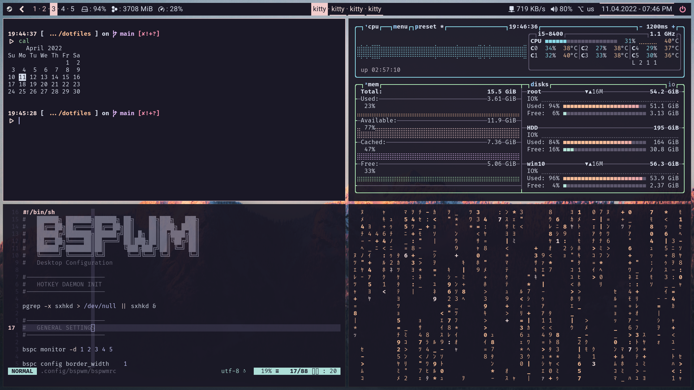
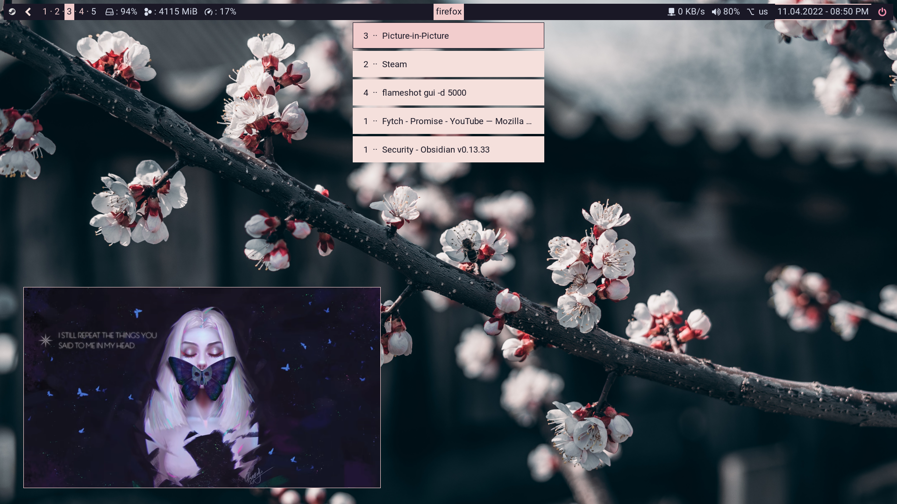

<div align="center">
    <h1>Dotfiles</h1>
    <p>
        Personal Arch Linux dotfiles
        (Deprecated in favour of macOS dotfiles)
    </p>
</div>

### Screenshots

|                Terminal              |                 Desktop                  |
|:------------------------------------:|:------------------------------------:|
|  |  |
|  |  |

---

### Content

#### ~/.config

- **bspwm** | Window Manager

- **polybar** | Status Bar

- **rofi** | Run Launcher

- **dunst** | Notification Daemon

- **kitty** | Terminal

- **sxhkd** | Hotkey Daemon

- **picom** (jonaburg) | Compositor

- **ranger** | TUI File Manager

- **neofetch** | System Fetch

- **nvim** | TUI Text Editor

- **betterlockscreen** | Lockscreen

- **redshift** | Night-light Service

- **btop** | TUI System Monitor

- **fontconfig** | Font Settings

- **colors** | Colorschemes

#### $HOME 

- **zsh** | Shell

- **Xresources** | X11 Settings

- **profile** | Environment Settings

- **xprofile** | X11 Startup Commands

- **themes** | GTK Themes


### Deployment

Dotfiles are deployed as symlinks into the ~/.config and $HOME directory as necessary, pointing back to the repository for easy updates and maintenance.

1. Clone this repo
```
git clone https://github.com/v-cassiel/dotfiles-legacy
```

2. Run the deployment script (**WIP!**) from within the dotfiles directory
```
cd dotfiles/
chmod +x deploy
./deploy
```

---

#### Notes

- Development is discontinued, configs will not updated
